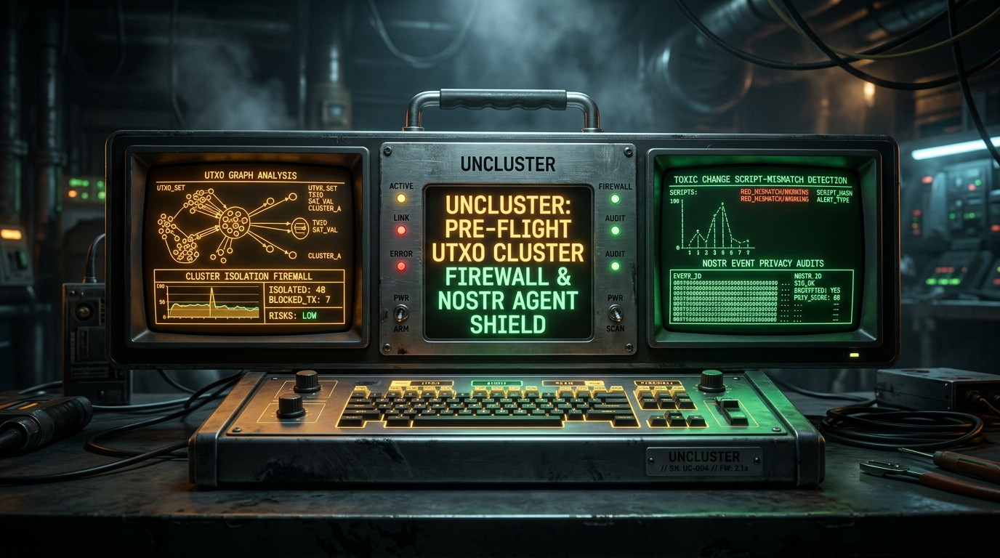

# UNCLUSTER // PRE-FLIGHT BITCOIN UTXO CLUSTER FIREWALL & NOSTR AGENT SHIELD



> **Zero-Leakage Pre-Flight UTXO Cluster Firewall & Autonomous Nostr Privacy Shield.**
> Built for Cypherpunks, Lightning Node Operators, and Autonomous Nostr Agents.

[](https://uncluster-firewall.vercel.app)
[](LICENSE)
[-00FF88?style=for-the-badge)](uncluster/engine/test_uncluster.py)
[](uncluster/cli/uncluster.py)
[](uncluster/engine/nostr_shield.py)

---

## The Critical Problem: On-Chain UTXO Deanonymization

In standard Bitcoin wallets, transaction creation is dangerously opaque. When a user or automated agent constructs a transaction:

1. **Common-Input Ownership Heuristic (CIOH) Poisoning**: Wallets co-spend multiple UTXOs to satisfy payment amounts. Surveillance firms (Chainalysis, Elliptic) automatically assume all inputs belong to the same entity. Mixing a KYC exchange withdrawal with an un-associated P2P CoinJoin coin instantly deanonymizes your entire UTXO lineage.
2. **Toxic Change Script Fingerprinting**: When sending from Native SegWit (`bc1q...`) but generating Legacy (`1...`) or Nested SegWit change outputs, the wallet leaks software-specific fingerprints and isolates the change address as the sender's.
3. **Round Amount & Deterministic Ordering Leaks**: Lacking BIP-69 lexicographical sorting or generating clean round payments leaks change ownership deterministically.
4. **Autonomous Nostr Agent Leakage**: AI agents and micro-merchants broadcasting NIP-01 events, NIP-04 encrypted DMs, and NIP-57 Zap receipts frequently include plaintext on-chain Bitcoin addresses. Relay gossip fanout permanently correlates Nostr public keys (`npub`) with on-chain UTXO clusters.

**Once broadcast to the mempool, privacy loss is irreversible.**

---

## Introducing Uncluster

**Uncluster** is an industrial-grade, zero-leakage pre-flight transaction firewall and privacy shield. It acts as an air-gapped cryptographic circuit-breaker between your coin selection and transaction signing.

```
┌──────────────────┐      ┌─────────────────────────┐      ┌──────────────────┐
│  Unsigned PSBT   │ ───► │  UNCLUSTER FIREWALL     │ ───► │ Sanitized PSBT   │
│  or Nostr Event  │      │  • CIOH Graph Analysis  │      │ Ready for HSM /  │
└──────────────────┘      │  • Toxic Change Check   │      │ Coldcard Signing │
                          │  • Nostr Gossip Shield  │      └──────────────────┘
                          └─────────────────────────┘
```

### Key Capabilities

- **Pre-Flight CIOH Interception**: Graph-traverses all candidate inputs before signing. Detects cross-cluster contamination between KYC, Mining, P2P, and Cold Storage clusters.
- **Toxic Change Detector**: Flags script type mismatches (SegWit vs Taproot vs Legacy) and warns against round-number heuristics.
- **BIP-69 Verification**: Enforces strict lexicographical sorting of inputs and outputs to prevent wallet fingerprinting.
- **Sanitized Coin Selection Recalculator**: Given a target payment budget, autonomously selects clean, single-cluster UTXO pools, ensuring 0 CIOH merges.
- **Nostr Agent Shield (NIP-01/04/44/57)**: Audits Nostr events for leaked Bitcoin addresses, zap receipt change leaks, and excessive relay fanout correlation.
- **Tactile Industrial Cyberdeck**: Hardware-inspired CRT phosphor terminal interface with amber/emerald vector graphics, scanlines, and Web Audio mechanical feedback.
- **Developer CLI**: Zero-dependency Python 3 CLI for bitcoind RPC pipelines, scripts, and headless daemons.

---

## Cyberdeck Web Console

Experience Uncluster live at: **[https://uncluster-firewall.vercel.app](https://uncluster-firewall.vercel.app)**

Features of the web cyberdeck:
- **Hotkeys [1-4]**: Instant switching between real-world transaction vectors:
  - `[1]` Mixed KYC & CoinJoin Co-Spend (High Exposure)
  - `[2]` Toxic Change Script Mismatch (SegWit -> Legacy)
  - `[3]` Sovereign Clean Single-Cluster Payment (100% Score)
  - `[4]` Nostr Zap Receipt Relay Exposure
- **Live PSBT Injector**: Paste or test custom transactions with arbitrary cluster tags and satoshi amounts.
- **Autonomous Coin Selector**: Recalculates clean UTXOs with custom target payment and fee budgets in real time.
- **Phosphor Controls**: CRT scanline toggles, phosphor burn-in simulation, and mechanical audio switch.

---

## Developer CLI Usage

Run Uncluster locally with zero external dependencies:

```bash
# 1. Audit a raw transaction hex or PSBT
python3 -m uncluster.cli audit --hex 0200000002...

# 2. Sanitize coin selection from an available UTXO pool
python3 -m uncluster.cli sanitize --target 105000 --fee 1800

# 3. Audit a Nostr event before relay broadcast
python3 -m uncluster.cli nostr-check --event '{"kind": 4, "content": "Send sats to bc1qar0srrr7xfkvy5l643lydnw9re59gtzzwf5mdq"}'
```

### Deterministic Test Suite

```bash
python3 -m unittest uncluster.engine.test_uncluster
# Ran 8 tests in 0.000s -> OK (100% Pass)
```

---

## Architecture & Codebase

```
uncluster/
├── engine/
│   ├── crypto_models.py      # Core domain models (UTXO, TxInput, TxOutput, NostrEvent)
│   ├── cluster_analyzer.py   # Deterministic CIOH graph analyzer, BIP-69 & toxic change rules
│   ├── nostr_shield.py       # Nostr NIP-01/04/57 leak detector & relay correlation auditor
│   └── test_uncluster.py     # Deterministic verification test suite (8/8 pass)
├── cli/
│   └── uncluster.py          # Terminal CLI with ANSI box-drawing ASCII maps & exit codes
├── web/
│   ├── index.html            # Cyberdeck phosphor CRT console
│   ├── styles.css            # CRT scanlines, amber/emerald phosphors, cyberdeck layout
│   └── app.js                # Web Audio synthesizer, live pre-flight analyzer, coin selector
├── demo/
│   ├── voiceover_script.json # Timed scene script
│   ├── generate_audio.py     # Neural TTS synthesizer
│   ├── record_playwright.py  # High-DPI screen recorder
│   └── assemble_video.py     # Ffmpeg compositor
└── assets/
    ├── logo.png              # Phosphor cyberdeck shield emblem
    └── banner.png            # 16:9 presentation banner card
```

---

## Cypherpunk Manifesto Alignment

> *"Privacy is necessary for an open society in the electronic age... We cannot expect governments, corporations, or other large, faceless organizations to grant us privacy out of their beneficence... We must defend our own privacy if we expect to have any."*  
> — Eric Hughes, *A Cypherpunk's Manifesto* (1993)

Uncluster is dedicated to preserving sovereign on-chain privacy for every human and autonomous agent transacting on the Bitcoin network.

---

## License

MIT License. Designed and engineered for the **BOSS Battle 2026** Bitcoin & Nostr Open Source Hackathon.
